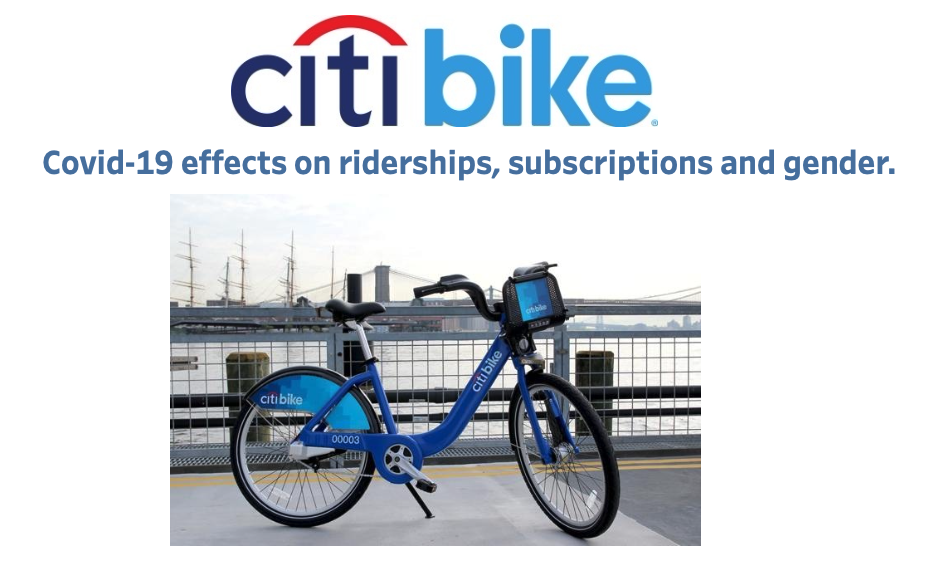
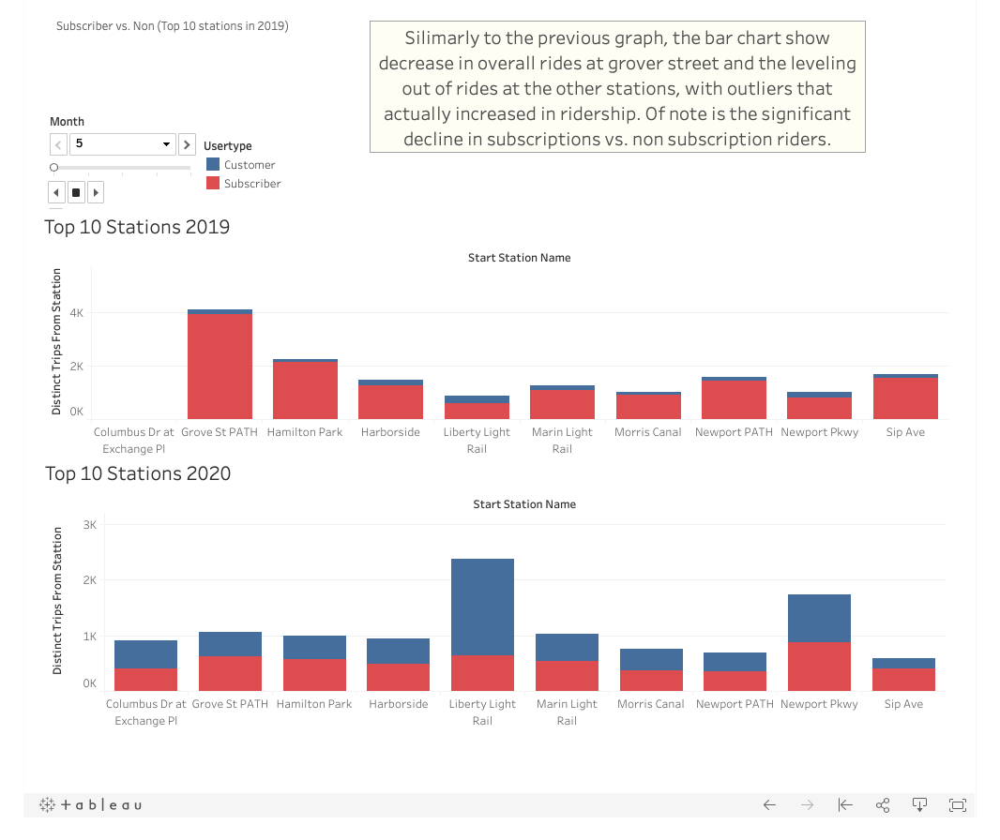
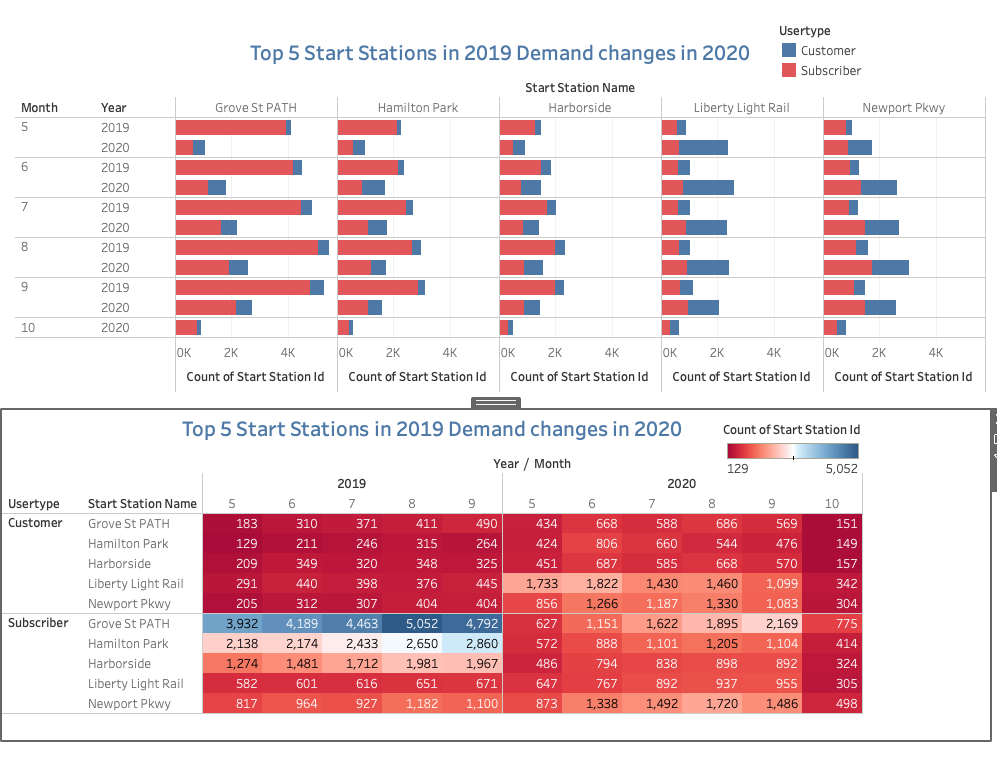
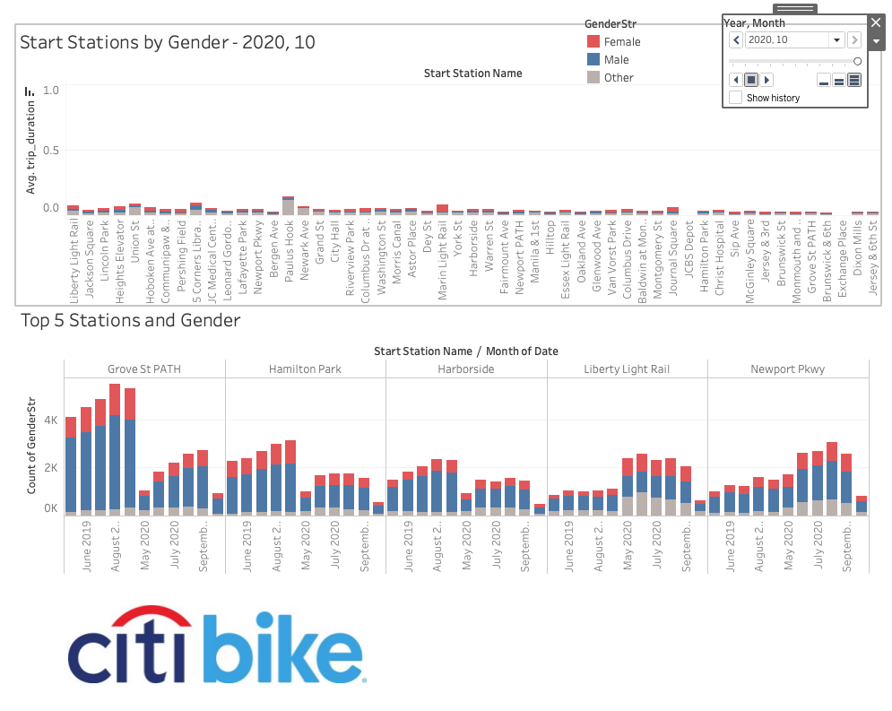
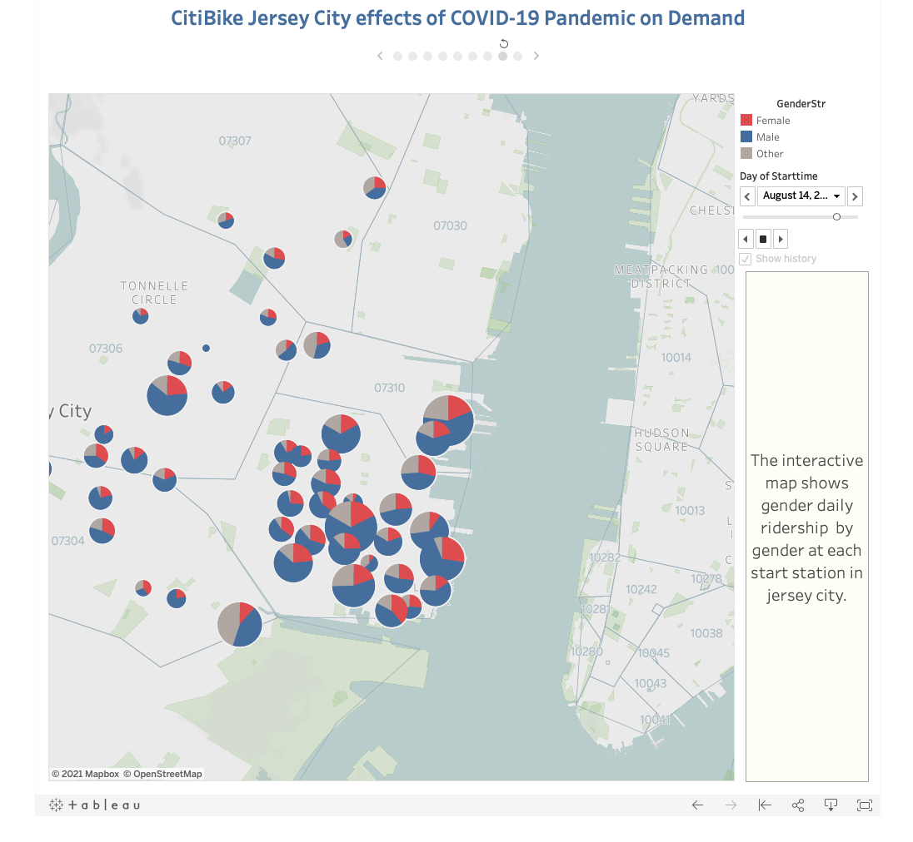

# tableau-challange
<h3>CitiBike Jersey City effects if COVID-19 Pandemic on Demand</h3>

Analysis of Citi Bike in Jersey City, NJ. The study investigates a five-month window, commonly associated with the summer season. Analyzing May thru September of 2019 (pre-covid) and 2020 during the pandemic, did the consumer base change. If so, are there opportunities to target marketing to regain ridership or growth during the pandemic? 

<a href="https://public.tableau.com/profile/tim.samson#!/vizhome/CitiBike_16132584732100/Story1">Link to Presentation</a>

<h3>Visualizations</h3>

<h4>Demand Dashboard</h4>

<a href="https://public.tableau.com/profile/tim.samson#!/vizhome/CitiBike_16132584732100/DemandSubscribervs_Non">Link to Demand Dashboard</a>

<h4>Subscriber</h4>

<a href="https://public.tableau.com/profile/tim.samson#!/vizhome/CitiBike_16132584732100/Subscribervs_non">Link to Subscriber Dashboard</a>

<h4>Gender</h4>

<a href="https://public.tableau.com/profile/tim.samson#!/vizhome/CitiBike_16132584732100/CitiBikeGenderPrePostCovid">Link to Gender Dashboard</a>

<h4>Interactive Map</h4>

<a href="https://public.tableau.com/profile/tim.samson#!/vizhome/CitiBike_16132584732100/StationStartdoubleaxisTripStartcountandGenderBreakdown">Link to Interactive Map</a>

<h3>File Structure</h3>

There are 3 folders within the repository:
    <ul><li>data- contains full data file, as well as indiviudal files for each of the fev months for both years (19 & 20)</li>
    <li>Tableau Woorkbook</li>
            <ul><li>Tableau Workbook contianing all files, story and dashboards. </li>
    <li>Images- contains example visualiations</li>
    <li>Additionally, the Jupyter Notebook is located in the repo, used to combine data into one CSV</li>
    </ul>

<h3>Analysis</h3>

The top 10 stations in Jersey City remained relatively consistent; individual ridership varied drastically from year to year. Overall, ridership decreases at most stations; However, some see increases; this could correlate to the rider type (further in analysis) evolving from work commute to more leisure style activities.

The subscriber to Non-subscriber ratio shows the most significant impact across the selected data. Subscribers significantly drop off in 2020 compared to 2019; this offers an opportunity to reengage with those riders with lapsed subscriptions. Further research should be conducted to actualize the reasons that subscribers dropped off.
 

Station usage decreased during the pandemic in some stations; others saw an increase. Bike usage should be further researched to determine if there is an opportunity to move assets to underperforming locations to those performing better in 2020 vs. 2019, should inventory be needed in those locations.
 

Gender information appears to be lacking as the non-subscriber ratio increases. However, available gender information indicates that the gender ratio remains relatively consistent, indicating that gender did not play a role in reducing riders.
 

Overall, the analysis indicates that usage has dropped as well as the subscriber ratio. There is an opportunity to welcome lapsed subscribers back with offers and build back up the subscriber base. Additionally, given the increase in non-subscribers, there potentially is a new opportunity to convert them into new subscribers to the program.
 

<h3>Dependencies</h3>
 <ul>
<li>Pandas</li>
<li>Jupyter Notebook</li>
<li>Tableau</li>
</ul>

